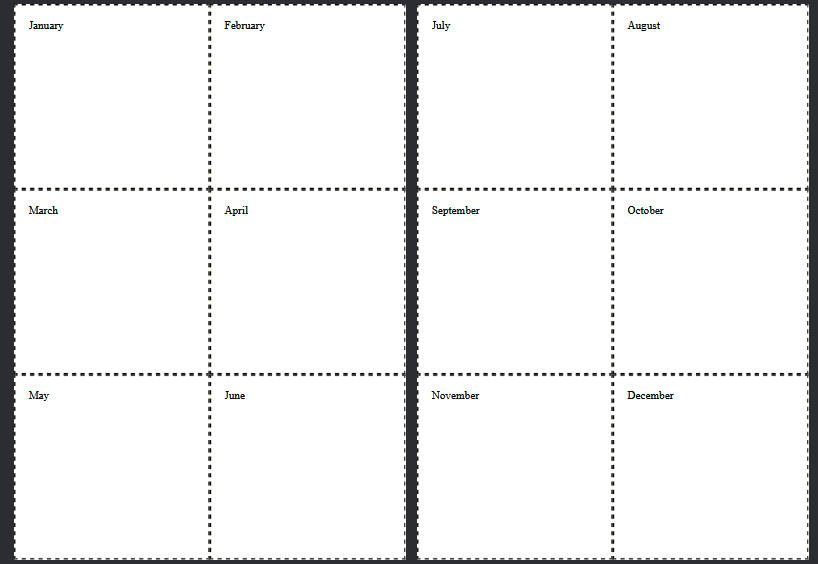
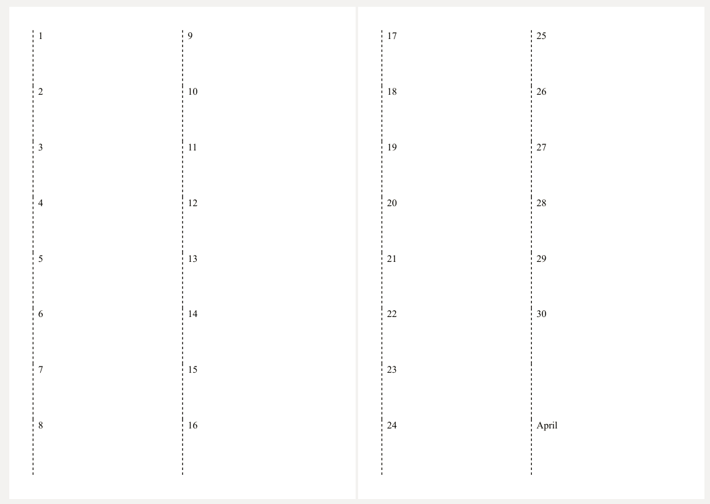
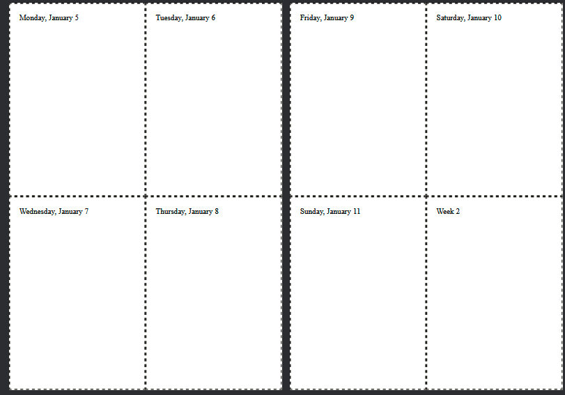

Minimalist A5-size printable planner / calendar with views by year,
month, and ISO weeks 

Generate a file called yearname.html (eg 2026.html) using make.py

Print the file using your favorite web browser

The first page is blank to ensure proper printing, followed by a 2-page
spread of all months in the year:

Every month begins with a 2-page spread overview of the month:

and then shows the weeks of the month until the next month begins as
2-page spreads, the last section of the week being for general notes
with the ISO week number included for convenience's sake:

To prevent duplication of weeks, a week "belongs" to whatever month
that week's Thursday falls upon. Edge cases are caught. 